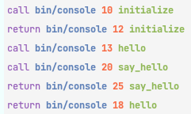
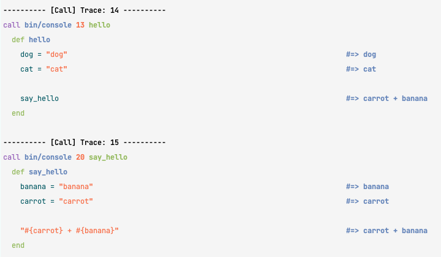

# Bugzilla

Currently in Alpha. There will be bugs and some features may not work as expected.

Todo: Installation

## Installation

Install the gem and add to the application's Gemfile by executing:
Todo: Upload to rubygems.org and update the gem name below

    $ bundle add UPDATE_WITH_YOUR_GEM_NAME_PRIOR_TO_RELEASE_TO_RUBYGEMS_ORG

If bundler is not being used to manage dependencies, install the gem by executing:

    $ gem install UPDATE_WITH_YOUR_GEM_NAME_PRIOR_TO_RELEASE_TO_RUBYGEMS_ORG

## Usage

### Gathering a trace

```ruby
trace = Tracer.perform! do
  example_method
end
```

### Analyzing a trace

```ruby
trace.trace
### Outputs the stack trace
```

Example:


```ruby
trace.source_trace
```
**Example Output


### Options

The options are a work in progress and are in need of improvement, along with overall project structure.  Currently options are set to each instance of `Tracer`.

- `disable_filter`, default, `false`  # Disables all filters on stack trace
- `colourise`, default, `true`, colourise output
- `ignored_paths`, takes an array of strings for paths you want to reject.
- `gsub_filters`, takes an array of strings.  gsubing them from stack traces.
- @colour_opts = {
    event: :light_red, # example
    lineno: 
    method_id:
    args:
    defined_class:
    return_value:
    exception:
    instance_variables:
    object_id:
}

**Supported colours**,

`:blue`, `:light_red` , `:black` , `:purple` , `:light_green` , `:red` , `:cyan` , `:yellow` , `:green` , `:gray`, `:light_blue` , `:brown` , `:dark_gray` , `:light_purple` , `:white` , `:light_cyan`


### Querying a trace

```ruby
trace.where(method_id: :example_method, method_id: :example_method)
# all cases where both are try
```

```ruby
trace.where_an(defined_class: :example_class, method_id: :example_method)
# all cases where any condition true
```

```ruby
trace.where_not(method_id: :example_method)
# all cases where method_id is not example_method
```

Supported options:
`defined_class`, `method_id`, `args`, `return_value`, `exception`, `instance_variables`, `object_id`


## Contributing

TODO: Update the below
Bug reports and pull requests are welcome on GitHub at https://github.com/[USERNAME]/Bugzilla. This project is intended to be a safe, welcoming space for collaboration, and contributors are expected to adhere to the [code of conduct](https://github.com/[USERNAME]/Bugzilla/blob/master/CODE_OF_CONDUCT.md).

## License

The gem is available as open source under the terms of the [MIT License](https://opensource.org/licenses/MIT).

## Code of Conduct

Everyone interacting in the Bugzilla project's codebases, issue trackers, chat rooms and mailing lists is expected to follow the [code of conduct](https://github.com/[USERNAME]/Bugzilla/blob/master/CODE_OF_CONDUCT.md).
